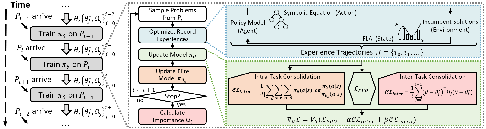

# LiBOG


Official implementation of our paper **"LiBOG: Lifelong Learning for Black-Box Optimizer Generation"**, which is accepted at *IJCAI* 2025. In this work, we tackle the problem of **lifelong learning from a sequence of BBO problem distributions to generate high-performance BBO optimizer** using a novel **LiBOG**, which achieves **good forward transferring, mild catastrophic forgetting and stable learning**.





**Built upon**: [Symbol](https://github.com/MetaEvo/Symbol) [1] – used and extended with MIT License

[1] Chen, J., Ma, Z., Guo, H., Ma, Y., Zhang, J., & Gong, Y. J. SYMBOL: Generating Flexible Black-Box Optimizers through Symbolic Equation Learning. In The Twelfth International Conference on Learning Representations.

---

## Repository Structure

```
├── run_lifelong.py         # Entry point for training/testing
├── options.py              # Running options for training/testing
├── execute/                # Function code for training/testing
├── model/                  # Model definitions
├── expr/                   # Code for expression
├── dataset/                # Dataset loading and preprocessing of BBO problems
├── env/                    # RL environment of BBO optimizer for solving problems
├── utils/                  # Utility functions and helpers
├── population/             # About solution population
├── pbo_env/                # Classic BBO optimizers
├── requirements.txt        # Python dependencies
└── README.md               # This file
```

## Requirements

The dependencies of this project are listed in requirements.txt. You can install them using the following command.
```
pip install -r requirements.txt
```

## Quick Start
```
python run_lifelong.py --train --ll_training_method LiBOG --run_name test_code
```

## Citing
```
@inproceedings{LiBOG,
author={Pei, Jiyuan and Mei, Yi, and Liu, Jialin and Zhang, Mengjie},
title={LiBOG: Lifelong Learning for Black-Box Optimizer Generation},
booktitle = {34th International Joint Conference on Artificial Intelligence},
year={2025},
}
```