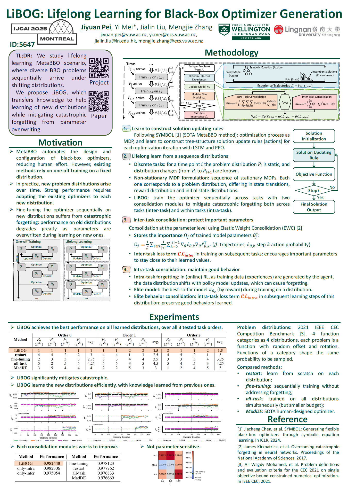

# LiBOG

[](https://arxiv.org/abs/2505.13025)

Official implementation of our paper **"LiBOG: Lifelong Learning for Black-Box Optimizer Generation"**, which is accepted at *IJCAI* 2025. In this work, we tackle the problem of **lifelong learning from a sequence of BBO problem distributions to generate high-performance BBO optimizer** using a novel **LiBOG**, which achieves **good forward transferring, mild catastrophic forgetting and stable learning**.


<!--  -->



## Citing

LiBOG: Lifelong Learning for Black-Box Optimizer Generation, Jiyuan Pei, Yi Mei, Jialin Liu and Mengjie Zhang. Proceedings of the Thirty-Fourth International Joint Conference on Artificial Intelligence (IJCAI) 2025. pp. 8912--8920.

```
@inproceedings{LiBOG,
  title     = {LiBOG: Lifelong Learning for Black-Box Optimizer Generation},
  author    = {Pei, Jiyuan and Mei, Yi and Liu, Jialin and Zhang, Mengjie},
  booktitle = {Proceedings of the Thirty-Fourth International Joint Conference on Artificial Intelligence, {IJCAI-25}},
  publisher = {International Joint Conferences on Artificial Intelligence Organization},
  editor    = {James Kwok},
  pages     = {8912--8920},
  year      = {2025},
  month     = {8},
  note      = {Main Track},
  doi       = {10.24963/ijcai.2025/991},
  url       = {https://doi.org/10.24963/ijcai.2025/991},
}

```


## Repository Structure

```
├── run_lifelong.py         # Entry point for training/testing
├── options.py              # Running options for training/testing
├── execute/                # Function code for training/testing
├── model/                  # Model definitions
├── expr/                   # Code for expression
├── dataset/                # Dataset loading and preprocessing of BBO problems
├── env/                    # RL environment of BBO optimizer for solving problems
├── utils/                  # Utility functions and helpers
├── population/             # About solution population
├── pbo_env/                # Classic BBO optimizers
├── requirements.txt        # Python dependencies
└── README.md               # This file
```


**Built upon**: [Symbol](https://github.com/MetaEvo/Symbol) – used and extended with MIT License

## Requirements

The dependencies of this project are listed in requirements.txt. You can install them using the following command.
```
pip install -r requirements.txt
```

## Quick Start
```
python run_lifelong.py --train --ll_training_method LiBOG --run_name test_code
```
